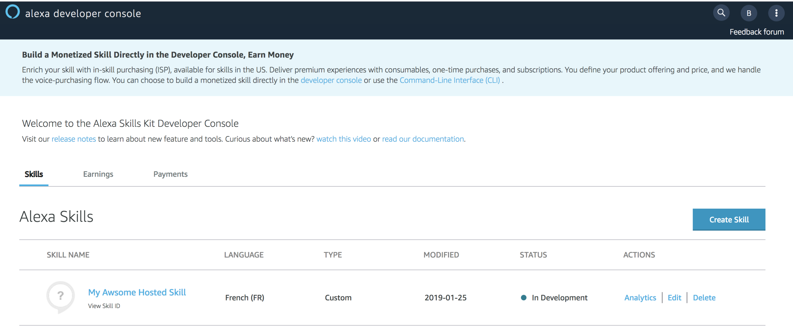
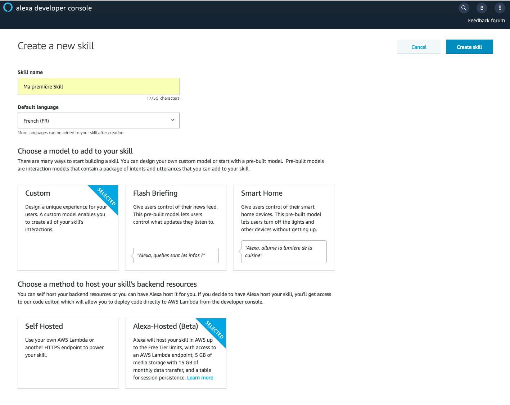
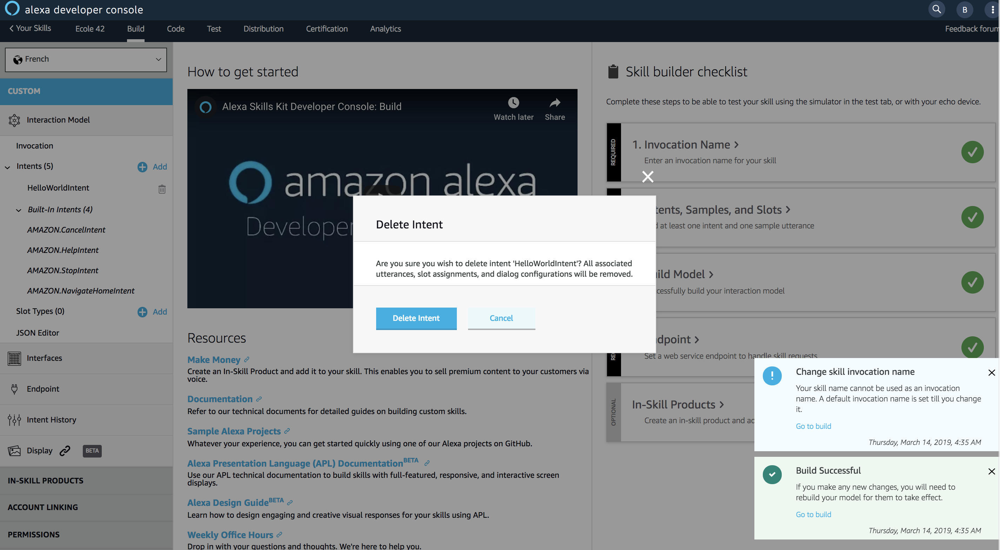
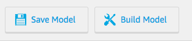
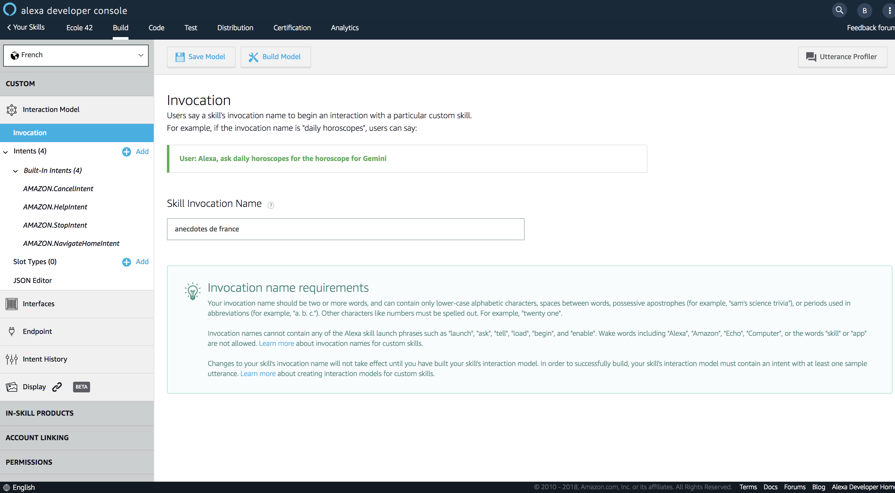
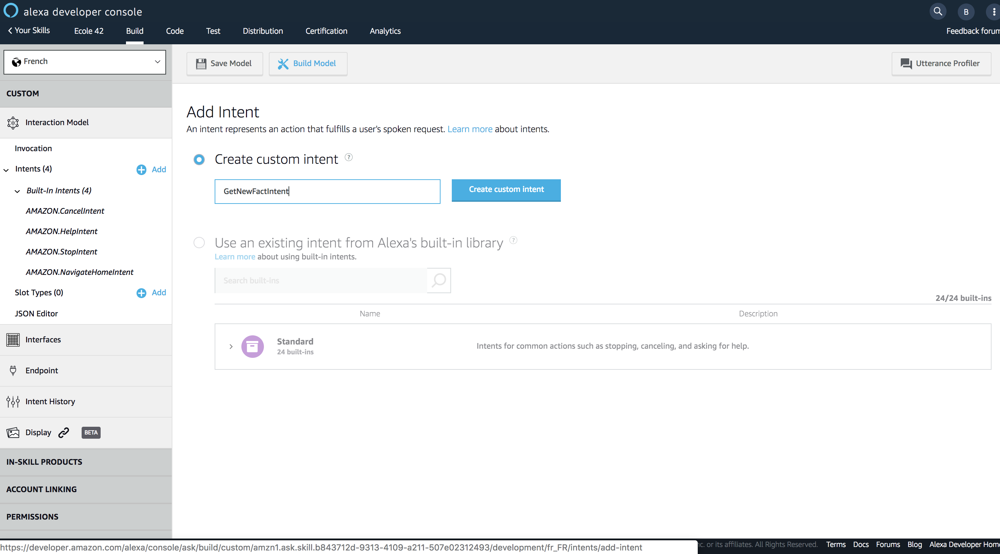
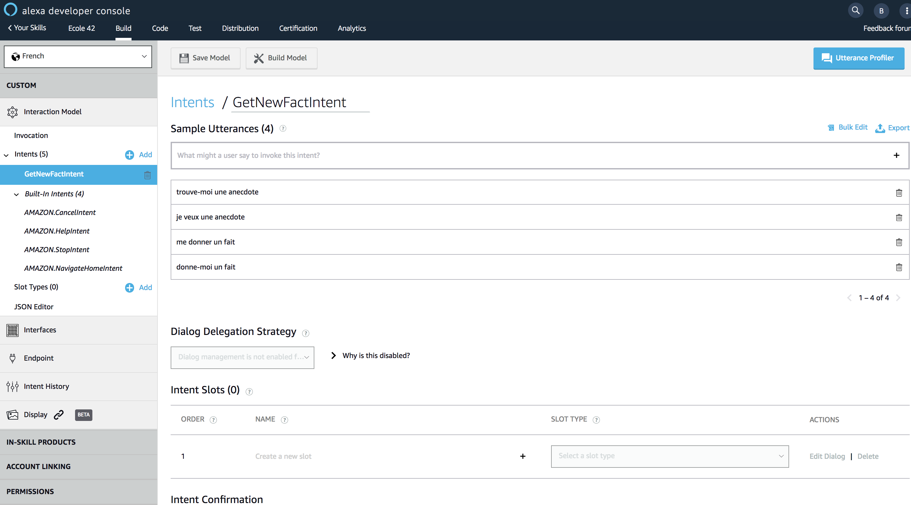
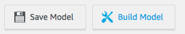

# Skill Creation

You will create and test your First Alexa Skill fully from the [Alexa Developer Console](https://developer.amazon.com/alexa/console/ask).

### **Objective** :  You will create your first Voice User Interface using the Alexa Developer Console.

1. Navigate to the [Alexa Developer Console](https://developer.amazon.com/alexa/console/ask) 



2. Create a new Custom Skill with `Alexa-Hosted` for your backend resources



3. On the `Build` Tab of your Skill, delete  the intent `HelloWorldIntent`



4. Save your Interaction Model



>  **Important**: The developer console does not automatically save your work as you make changes. If you close the browser window without clicking Save Model, your work is lost.

5. Update your invocation name to `anecdotes de france`



6. Save your Interaction Model


7. Add a Custom Intent to your Interaction Model named `GetNewFactIntent`



8. Save your Interaction Model


9. Add the following utterances to the newly created intent `GetNewFactIntent`

```
trouve-moi une anecdote
                    
je veux une anecdote

me donner un fait

donne-moi un fait
```



10. Save your Interaction Model


11. Build your Interaction Model



> **Important**: You must successfully build the model before you can test it.

### Next : [Create your Skill Backend](./02-backend.md)