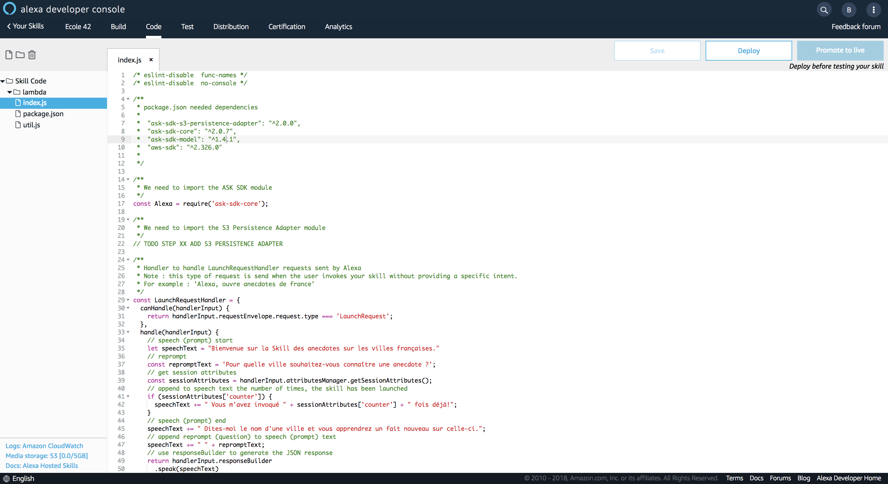
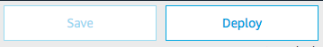

# Skill Backend

### **Objective** : Add the code to handle the requests sent by Alexa to your service on the Alexa Developer Console.

1. Navigate to `Code` Tab and copy-paste [this backend code](https://gist.githubusercontent.com/nachawat/109e2085659c3060cd11310fbed00979/raw/8923247e11070ef545c1632ff39099bc8df34329/skill-anecdotes-index-starter.js)

2. Save your code

>  **Important**: The developer console does not automatically save your work as you make changes. If you close the browser window without clicking Save, your work is lost.

3. Deploy your code

> **Important**: You must successfully deploy the code before you can test it.

### Next : [Test your Skill](./03-test.md)