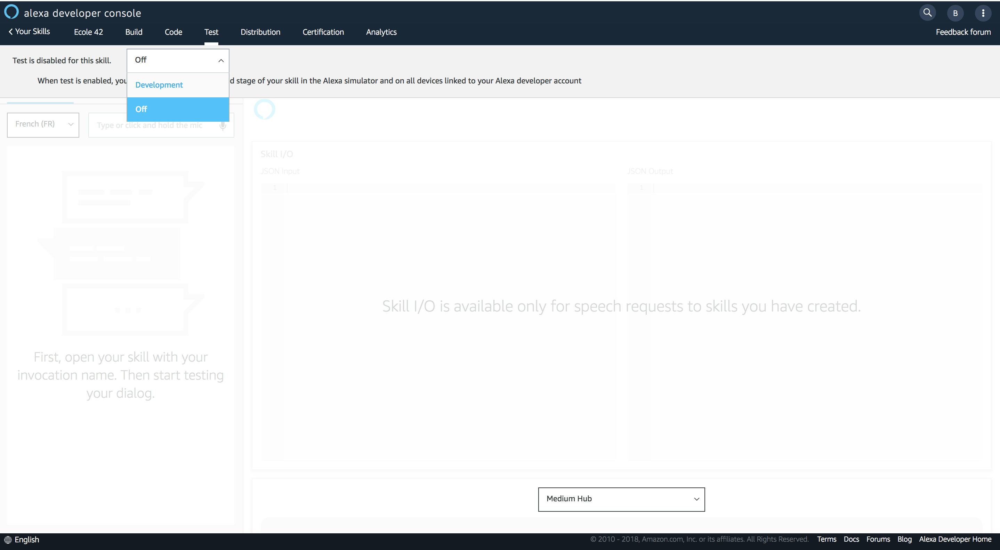
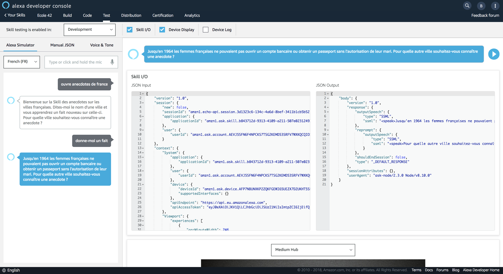

# Skill Testing

### **Objective** : You will test the newly created Skill using the Test Simulator from the Alexa Developer Console.

1. Navigate to the `Test` Tab and active the testing of your Skill in ```Development```



2. Navigate to the `Test` Tab and enter the following utterance in the simulator ```ouvre anecdotes de france```


### Next : [Add a Slot to your Voice User Interface](./04-add-slot-frontend.md)