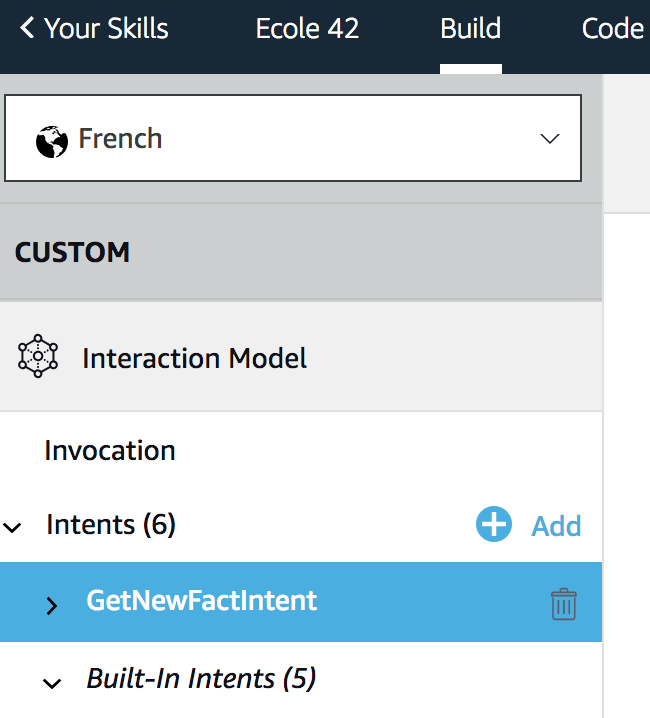
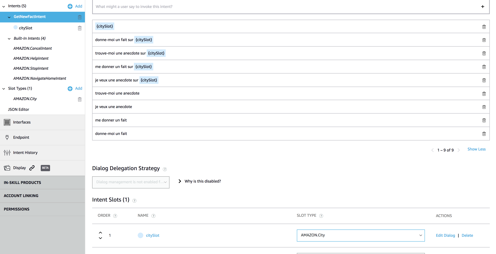

# Add Slot to Interaction Model

### **Objective** : You will add a slot to your Voice User Interface (VUI) to be able to understand a city mentionned by a user.

1. Navigate to the `Build` Tab and select the `GetNewFactIntent`



2. On the intent `GetNewFactIntent` add the following utterances :

```
{citySlot}

donne-moi un fait sur {citySlot}

trouve-moi une anecdote sur {citySlot}

me donner un fait sur {citySlot}

je veux une anecdote sur {citySlot}
```



>  **Important**: A Slot must have a Slot Type assigned to be functional. In our case, we want the newly created slot to recognize cities. We will select as Slot Type for `citySlot` the predefined Type Slot `AMAZON.City` 

3. Define the Slot Type for Slot `citySlot` to be `AMAZON.City`


4. Save your Interaction Model


>  **Important**: The developer console does not automatically save your work as you make changes. If you close the browser window without clicking Save Model, your work is lost.


5. Build your Interaction Model


> **Important**: You must successfully build the model before you can test it.

### Next : [Handle the Slot in your backend](./05-add-slot-backend.md)