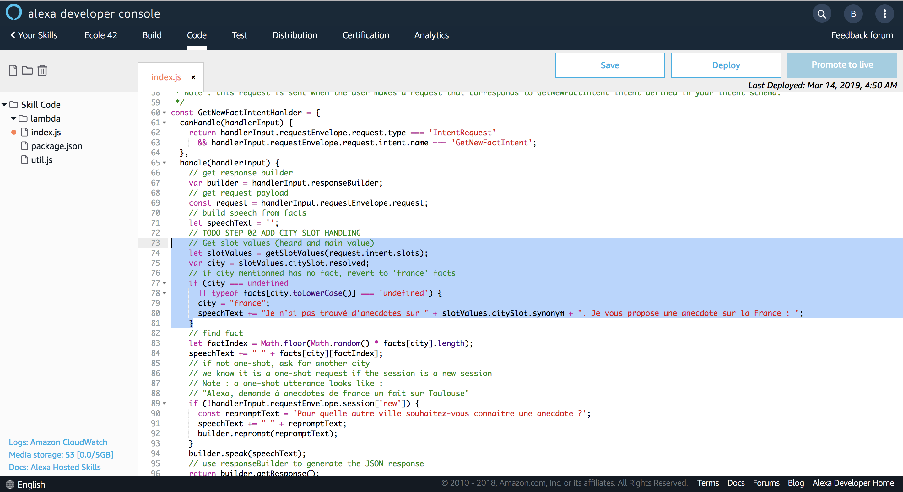

# Handle Slot in your backend

### **Objective** : You will update the code to take into account the Slot value sent by Alexa when mapped to intent `GetNewFactIntent`. It will allow you to provide a fact on the city spoken by the user.

1. Navigate to `Code` Tab and located the following comment :

```javascript
// TODO STEP 02 ADD CITY SLOT HANDLING
```



2. Replace the following code 

```javascript
    var city = "france";
```

by

```javascript
    // Get slot values (heard and main value)
    let slotValues = getSlotValues(request.intent.slots);
    var city = slotValues.citySlot.resolved;
    // if city mentionned has no fact, revert to 'france' facts
    if (city === undefined
      || typeof facts[city.toLowerCase()] === 'undefined') {
      city = "france";
      speechText += "Je n'ai pas trouvé d'anecdotes sur " + slotValues.citySlot.synonym + ". Je vous propose une anecdote sur la France : ";
    }
```


3. Save your code


>  **Important**: The developer console does not automatically save your work as you make changes. If you close the browser window without clicking Save, your work is lost.

4. Deploy your code


> **Important**: You must successfully deploy the code before you can test it.

### Next : [Test your slot](./06-add-slot-test.md)