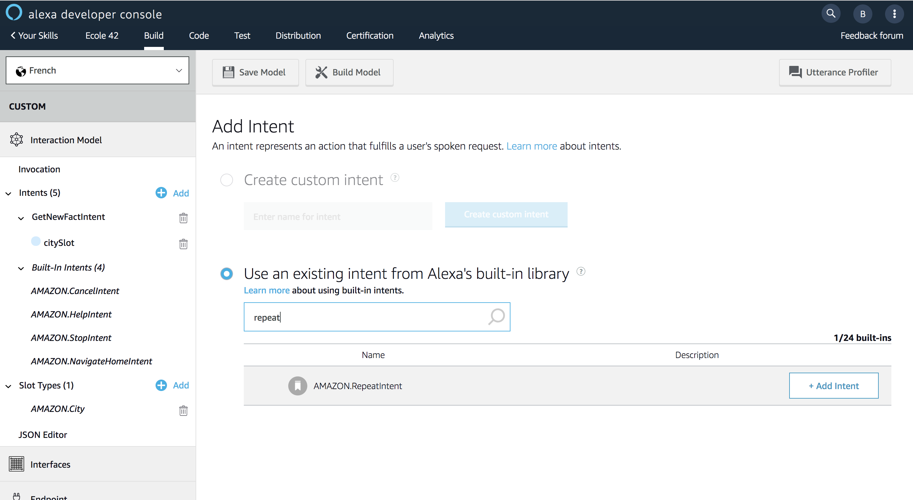

# Add Repeat Intent

### **Objective** : You will add a built-in intent named `AMAZON.RepeatIntent` to illustrate the usage of Session Attributes

1. Navigate to the `Build` Tab and add the built-in intent `AMAZON.RepeatIntent` to your interaction model

2. Save your Interaction Model

>  **Important**: The developer console does not automatically save your work as you make changes. If you close the browser window without clicking Save Model, your work is lost.

3. Build your Interaction Model

> **Important**: You must successfully build the model before you can test it.

### Next : [Handle Session Attributes](./08-add-session-attributes-backend.md)