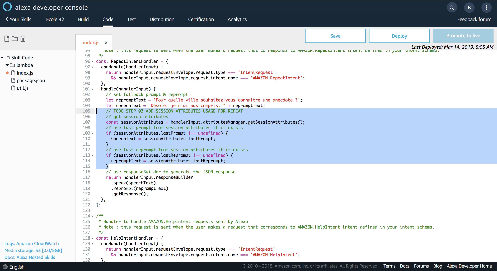

# Handle Session Attributes

### **Objective** : You will use Session Attributes to capture the latest prompt & reprompt and replay them when intent `AMAZON.RepeatIntent` is mapped.


1. Navigate to `Code` Tab and located the following comment :

```javascript
// TODO STEP 03 ADD SESSION ATTRIBUTES USAGE FOR REPEAT
```



2. Add the following code 

```javascript
// get session attributes
    const sessionAttributes = handlerInput.attributesManager.getSessionAttributes();
    // use last prompt from session attributes if it exists
    if (sessionAttributes.lastPrompt !== undefined) {
      speechText = sessionAttributes.lastPrompt;
    }
    // use last reprompt from session attributes if it exists
    if (sessionAttributes.lastReprompt !== undefined) {
      repromptText = sessionAttributes.lastReprompt;
    }
```


>  **Important**: Here you are only fetching the values from the Session Attributes. To see how the values from the Session Attributes are saved, look at the following Interceptor code : `ResponseRepeatInterceptor`.

3. Save your code


>  **Important**: The developer console does not automatically save your work as you make changes. If you close the browser window without clicking Save, your work is lost.

4. Deploy your code


> **Important**: You must successfully deploy the code before you can test it.

### Next : [Test Session Attributes Usage](./09-add-session-attributes-test.md)