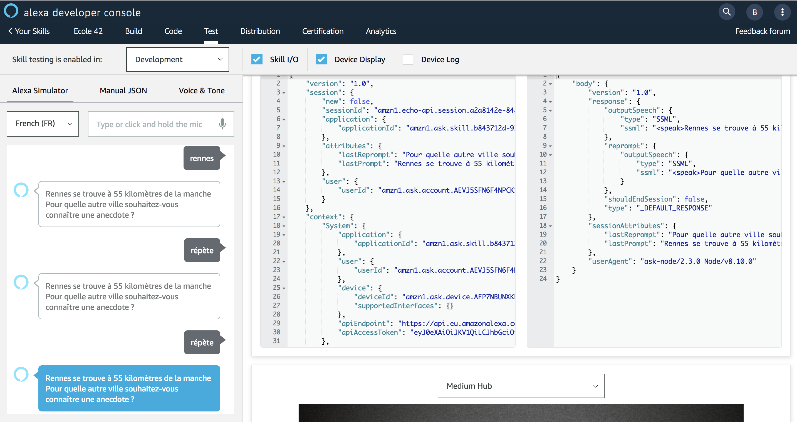

# Test Session Attributes

### **Objective** : You will test usage of Session Attributes on intent `AMAZON.RepeatIntent`.


1. Navigate to the `Test` Tab and enter the following utterance in the simulator ```ouvre anecdotes de france```


2. Enter the name of a city in the Test Simulator (e.g ```rennes``` or ```paris```)

3. Enter ```répète``` in the Test Simulator to ask for a repeat. The exact same prompt as the previous one shall be output.



### Next : [Add Persistent Attributes](./10-add-persistent-attributes-backend.md)