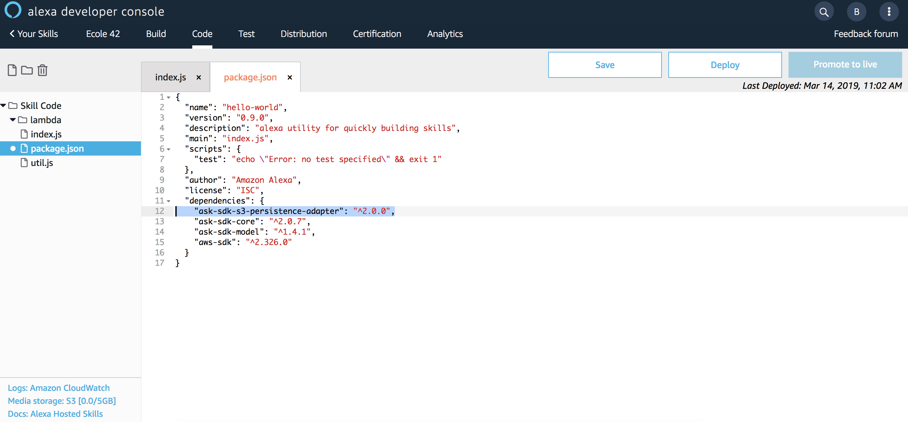
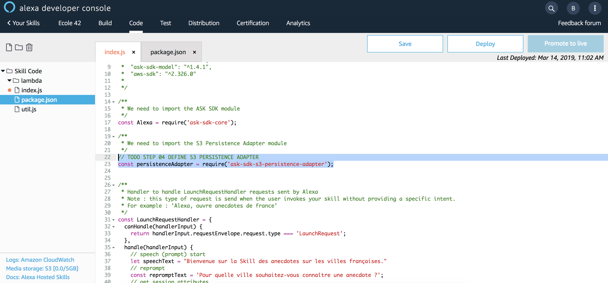
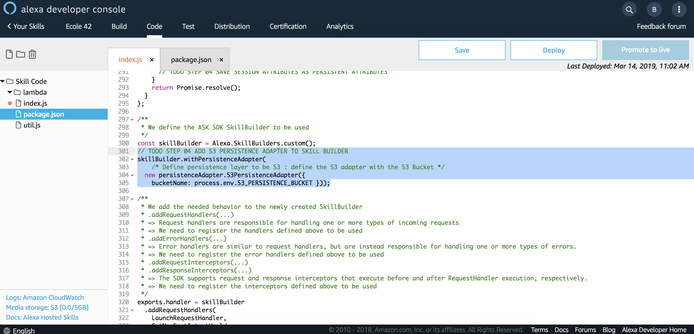
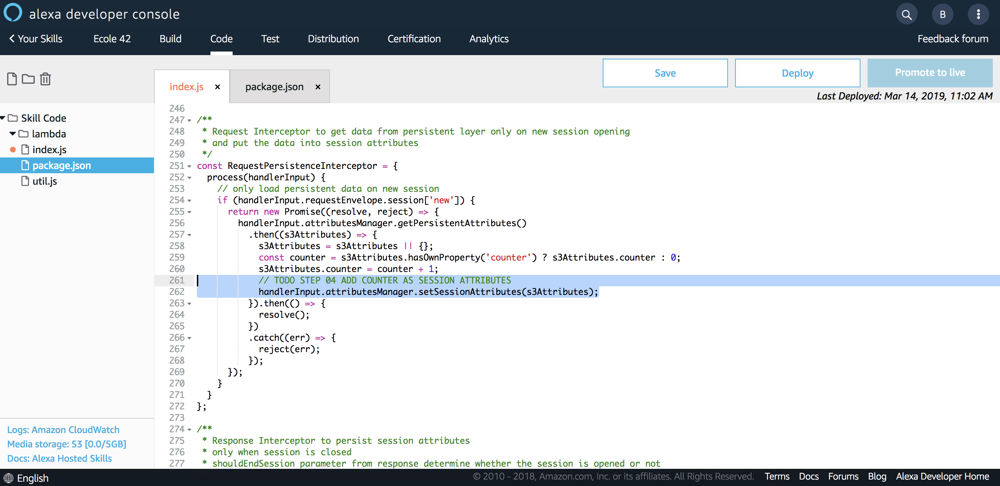
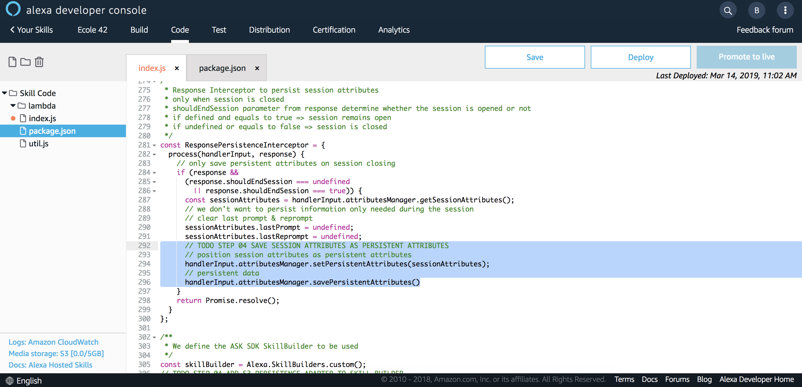
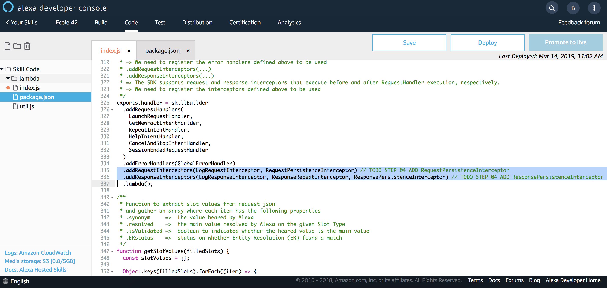

# Add Persistent Attributes

### **Objective** : You will use Persistent Attributes to add a counter to know how many times a given user initiated a new session.

1. Navigate to `Code` Tab and open file `package.json` to add the following dependency :

```javascript
      "ask-sdk-s3-persistence-adapter": "^2.0.0",
```



>  **Important**: We are using a Persistence Adapter compatible with Amazon S3 provided by the Alexa Skill Kit SDK. We thus need to add it as dependency to be able to use it in our code.

2. Save file `package.json`


>  **Important**: The developer console does not automatically save your work as you make changes. If you close the browser window without clicking Save, your work is lost.

3. Add S3 Persistence Adapter

* Open file `index.js` Tab and located the following comment :

```javascript
// TODO STEP 04 DEFINE S3 PERSISTENCE ADAPTER
```

* Add the following line of code to import the S3 Persistence Adapter module

```javascript
const persistenceAdapter = require('ask-sdk-s3-persistence-adapter');
```



* Located the following comment 

```javascript
// TODO STEP 04 ADD S3 PERSISTENCE ADAPTER TO SKILL BUILDER
```

and add the following code to attach the Persistence Adapter to the Skill Builder :

```javascript
skillBuilder.withPersistenceAdapter(
    /* Define persistence layer to be S3 : define the S3 adapter with the S3 Bucket */
  new persistenceAdapter.S3PersistenceAdapter({ 
    bucketName: process.env.S3_PERSISTENCE_BUCKET }));
```



4. Load Persistent Attributes as Session Attributes

For each new session initiated by a end user, we will load the attributes stored on Amazon S3 using the Persistence Adapter. During the lifetime of the session, we will use attributes from the session and by the end of the session, we will save back all attributes as persistent attributes.

To factorize code, this operation is done in an Request Interceptor namely `RequestPersistenceInterceptor`

* Located the following comment :

```javascript
// TODO STEP 04 ADD COUNTER AS SESSION ATTRIBUTES
```

and add the following code to load Persistent Attributes as Session Attributes :

```javascript
handlerInput.attributesManager.setSessionAttributes(s3Attributes);
```


5. Save Persistent Attributes

When a session is ended, we will use a Response Interceptor to get all relevant attributes from the session and persist those information as persistent.
This corresponds to `ResponsePersistenceInterceptor` interceptor.

* Located the following comment :

```javascript
// TODO STEP 04 SAVE SESSION ATTRIBUTES AS PERSISTENT ATTRIBUTES
```

and add the following code to save Persistent Attributes :

```javascript
// position session attributes as persistent attributes
handlerInput.attributesManager.setPersistentAttributes(sessionAttributes);
// persistent data
handlerInput.attributesManager.savePersistentAttributes()
```




6. Add Interceptors

Read and write operations for Persistent Attributes are performed in a `Request Interceptor` and `Response Interceptor` respectively.

Each Interceptor defined in our backend must be registered against the `Skill Builder` in use.

* Located the following comments :

```javascript
// TODO STEP 04 ADD RequestPersistenceInterceptor
// TODO STEP 04 ADD ResponsePersistenceInterceptor
```

and append the missing interceptors (`RequestPersistenceInterceptor` & `ResponsePersistenceInterceptor`) :

```javascript
  .addRequestInterceptors(LogRequestInterceptor, RequestPersistenceInterceptor)
  .addResponseInterceptors(LogResponseInterceptor, ResponseRepeatInterceptor, ResponsePersistenceInterceptor)
```



7. Save your code


>  **Important**: The developer console does not automatically save your work as you make changes. If you close the browser window without clicking Save, your work is lost.

8. Deploy your code


> **Important**: You must successfully deploy the code before you can test it.

### Next : [Test Persistent Attributes](./11-add-persistent-attributes-test.md)