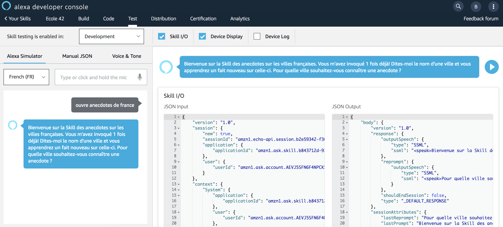
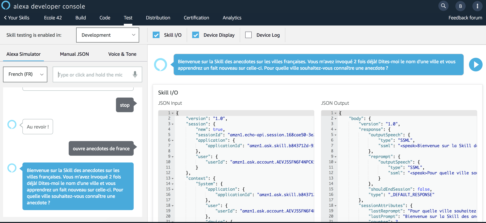

# Test Persistent Attributes : see counter increment

### **Objective** : You will test Persistent Attributes to count the number of times a given user started a new session in your Skill

1. Navigate to the `Test` Tab and enter the following utterance in the simulator ```ouvre anecdotes de france```



> Note : the counter increment is starting at 1

2. Stop the Skill's session and re-open a new session:



> Note : the counter increment has now a value equals to 2